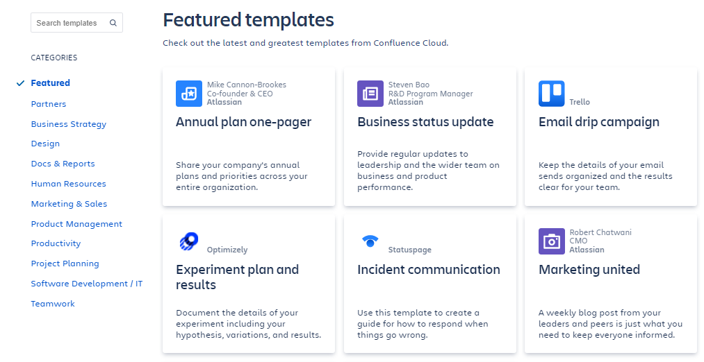
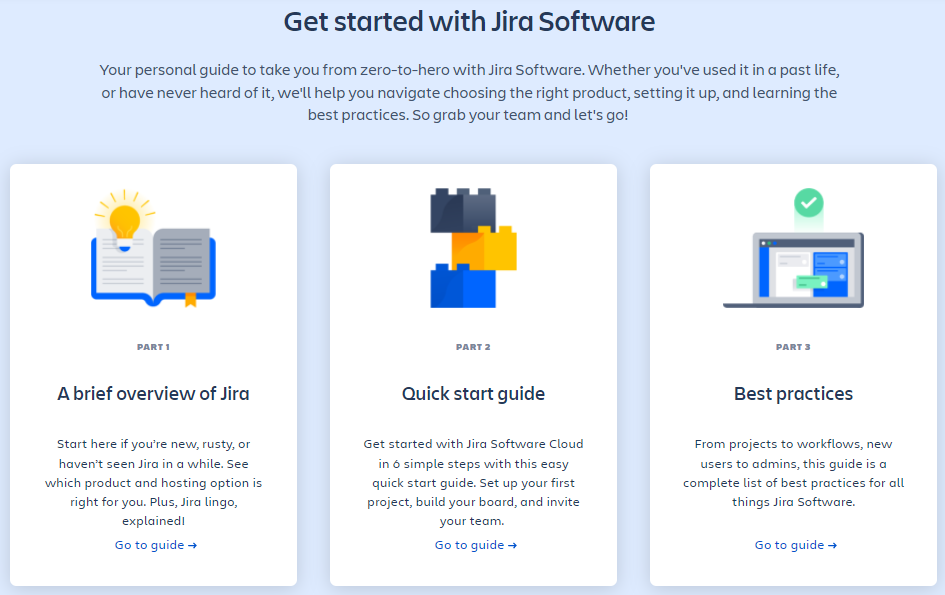
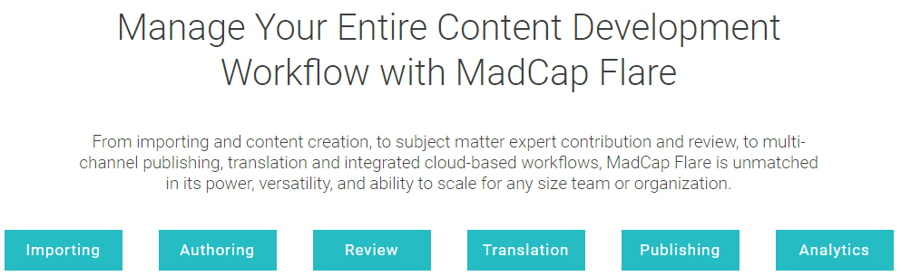

<!-- omit in toc -->
# Comparison of Jira, Confluence, and Flare Product Documentation
by Anna Meyer, 19 Nov 2021

<!-- omit in toc -->
## Contents

- [Introduction](#introduction)
- [Jira and Confluence user guides](#jira-and-confluence-user-guides)
  - [**Advantages**](#advantages)
  - [**Disadvantages**](#disadvantages)
- [Flare overview](#flare-overview)
  - [**Advantages**](#advantages-1)
  - [**Disadvantages**](#disadvantages-1)
- [Conclusion](#conclusion)

## Introduction
The aim of this report is to compare the available product documentation for three project management tools:  

* **Jira** and **Confluence** by Atlassian, and  
* **Flare** by MadCap  

with regard to the advantages and disadvandages.  

## Jira and Confluence user guides
Both **Jira** and **Confluence** were developed by Atlassian Corporation. Jira is a tool for software development and project management. Confluence is a tool for konwledge management and project collaboration.  

The **Official User Guides** that describe [Jira](https://www.atlassian.com/software/jira/guides) and [Confluence](https://www.atlassian.com/software/confluence/guides) have a similar structure and include the following tabs:  
* *Features*
* *Product guide*
* *Pricing*
* *Enterprise*

For Confluence, there is an additional tab dedicated to *Templates*, which lists available templates divided into categories.  

### **Advantages**
The basic product information provided by Atlassian is clear and well-structured as well as aesthetically pleasing. Features are described in a concise way (one sentence per feature). The Product guide provides the user with a brief overview of the tool, a quick start guide, best practices, demo versions, and tutorials, including video tutorials.  

### **Disadvantages**
While the information is comprehensive, it may be slightly overwhelming, especially for an unexperienced user. Even the 101 / getting started sections contain a vast amount of information, making it difficult to follow.  

Some of the hyperlinked information leads to external resources, like YouTube, Atlassian Univeristy or Agile Coach, which proliferates the general feeling that the software is complicated and not as user-friendly as it may seem at first glance.  

## Flare overview
**MadCap Flare** is a single-source publishing tool developed by MadCap Software.  

The product page offers a 30-day trial and an [Overview](https://www.madcapsoftware.com/products/flare/#content) of the tool.

### **Advantages**
The Overview section provides comprehensive information about the tool, preceded by links to subsections dedicated to different functions that can be performed with the use of Flare.

This menu is followed by a flowchart depicting possible file formats and the order of processes in twich the functions can be realised.

The whole product Overview is available in a single-flow description, which provides a complete insight into the tool’s features.

### **Disadvantages**
For whatever reason, the order of the general menu tabs seems a bit random:  

The *Why Flare?* tab would make more sense between the *Overview* and *What’s New* tabs.  

The Overview section on MadCap Flare is 3,500 words long, which is around 14 standard pages of text. Quite a handful.  

Between the Overview menu with link to subsections and the description of the first function, there is a 5-line client testimonial with a link to more testimonials, followed by two colourful self-promotion blocks with links. It makes the whole Overview section longer and less coherent.  

In general, there is too much visual material, like icons and screenshots. They create a slightly chaotic impression.  

## Conclusion
The tools described in this report constitute complex and versatile software. Having this in mind, the provided documentation is as clear, concise and user-friendly as it gets.  

But jokes aside, both formats of information presentation have their pros and cons. The nature of Jira, Confluence and Flare software – being umbrella applications covering numerous features and functions – makes them difficult to describe in a way that is both comprehensive and concise.  

Although the provided user guides and overviews may seem too extensive and user-unfriendly, most of the information provided is not redundant.